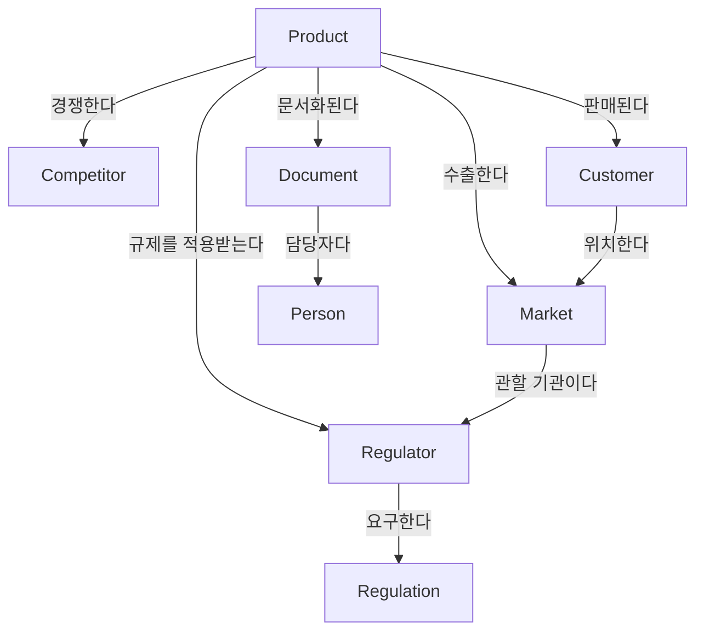

# 조직지식관리 온톨로지 설계 예시

> 에스테틱 주사제 수출 기업(코루파마 유형)을 사례로 한 실전 온톨로지 설계

---

## 1. 설계 목적

중소 수출 제약·미용의료기기 회사는 다음과 같은 지식 파편화 문제를 겪는다:
- 시장별 규제 정보가 담당자 개인 파일에만 존재
- 제품-시장-규제 간 관계가 머릿속에만 있고 공유되지 않음
- 경쟁사 동향과 내부 전략이 연결되지 않음

온톨로지 기반 설계는 이 파편들을 **의미 있는 관계망**으로 연결한다.

---

## 2. 핵심 객체(Object) 정의

| 클래스            | 정의                 | 예시 인스턴스                                          |
| -------------- | ------------------ | ------------------------------------------------ |
| **Product**    | 회사가 제조·판매하는 제품     | Mesoheal+, Renoxome+, PLLA Filler                |
| **Market**     | 수출 대상 국가·지역 시장     | 브라질, 멕시코, UAE, 동남아                               |
| **Customer**   | 수입 유통사, 병원, 클리닉    | 브라질 A유통사, 두바이 B클리닉                               |
| **Regulator**  | 규제기관 및 인증 체계       | ANVISA(브라질), COFEPRIS(멕시코), CE-MDR(EU), MFDS(한국) |
| **Competitor** | 국내외 경쟁 브랜드·기업      | 예) Hugel, Revanesse, Juvederm, Croma             |
| **Regulation** | 특정 시장의 인허가 요건 및 규정 | 브라질 의료기기 등록 요건, CE 기술문서 요건                       |
| **Person**     | 담당자, 파트너, 전문가      | RA 담당자, 현지 에이전트                                  |
| **Document**   | 공식 문서·보고서          | CE 기술문서, 브라질 등록 신청서, 시장조사 보고서                    |

---

## 3. 핵심 관계(Relation) 정의



| 관계 | 주체 → 객체 | 의미 |
|------|-------------|------|
| `수출한다` | Product → Market | 어떤 제품이 어느 시장에 판매되는가 |
| `규제를 적용받는다` | Product → Regulator | 제품이 어느 기관의 허가를 받아야 하는가 |
| `경쟁한다` | Product → Competitor | 동일 시장에서 경쟁하는 제품·브랜드 |
| `요구한다` | Regulator → Regulation | 규제기관이 어떤 기준을 요구하는가 |
| `판매된다` | Product → Customer | 어느 고객사에 공급되는가 |
| `위치한다` | Customer → Market | 고객사가 속한 시장 |
| `문서화된다` | Product → Document | 제품 관련 공식 문서 연결 |
| `담당한다` | Person → Document | 문서의 작성·관리 담당자 |

---

## 4. 실제 쿼리 예시

온톨로지가 구축되면 다음 질문에 즉시 답할 수 있다:

- "브라질에 수출 중인 제품 중 ANVISA 허가가 만료 예정인 것은?"
- "Hugel과 동일 시장에서 경쟁하는 우리 제품은?"
- "CE-MDR 갱신이 필요한 제품과 담당 RA 담당자 목록은?"
- "두바이 B클리닉이 구매하는 제품의 규제 현황은?"

---

## 5. Obsidian에서 실제 구현 방법

### 폴더 구조 (Class별 분류)
```
Legion/
├── 1. Memory/
│   └── know/
│       ├── [제품명].md         # Product 인스턴스
│       ├── [시장명].md         # Market 인스턴스
│       └── [규제기관명].md     # Regulator 인스턴스
├── Lab/
│   └── Projects/              # 프로젝트별 지식 작업
```

### Frontmatter로 속성(Property) 정의
```yaml
---
type: product
name: Mesoheal+
category: skinbooster
markets:
  - 브라질
  - UAE
  - 멕시코
regulator: ANVISA, COFEPRIS, CE-MDR
status: active
---
```

### 링크로 관계(Relation) 표현

각 제품 노트 본문에 다음처럼 관계를 명시한다:

```
## 수출 시장
- 브라질 시장 노트 링크 — ANVISA 허가 보유
- UAE 시장 노트 링크 — MOH 등록 진행 중

## 경쟁 제품
- Juvederm 노트 링크 — 동일 HA 필러 포지션
- Hugel Botulax 노트 링크 — 보툴리눔 독소 분야 경쟁

## 관련 문서
- Mesoheal+ CE 기술문서 노트 링크
- 브라질 ANVISA 등록 신청서 2024 노트 링크
```

### 태그 체계 (Taxonomy + 분류)
```
#type/product
#type/market
#type/regulator
#domain/regulatory-affairs
#domain/export
#status/active
#status/pending-renewal
```

### MOC (Map of Content) 노트 — 온톨로지 허브 역할
`수출 제품 지식지도.md` 같은 노트가 전체 관계망을 요약하고, 각 클래스별 인스턴스 노트로 연결되는 구조.

---

## 6. 기대 효과

- **담당자 교체 시 지식 유실 방지** — 관계가 노트에 명시됨
- **신시장 진출 분석 가속화** — 기존 시장·규제 관계에서 패턴 추출
- **AI 보조 활용** — 구조화된 노트 기반으로 LLM에게 정확한 컨텍스트 제공
- **경쟁 분석 고도화** — 제품-시장-경쟁사 삼각 관계 시각화

---

## 7. 핵심 인사이트

> 온톨로지 설계의 핵심은 "무엇이 있는가(분류)"가 아니라,  
> **"무엇이 무엇과 어떻게 연결되어 있는가(관계)"를 명시하는 것**이다.

Obsidian에서 이를 완벽히 구현하기는 어렵지만, frontmatter + 링크 + 태그 조합으로 **80% 수준의 온톨로지적 사고**를 적용할 수 있다. 중요한 것은 도구가 아니라 **의미 있는 관계를 의식적으로 정의하는 습관**이다.

---

*참고: Palantir Foundry Ontology 설계 원칙 · W3C OWL 스펙 · 사내 도메인 지식 기반*
