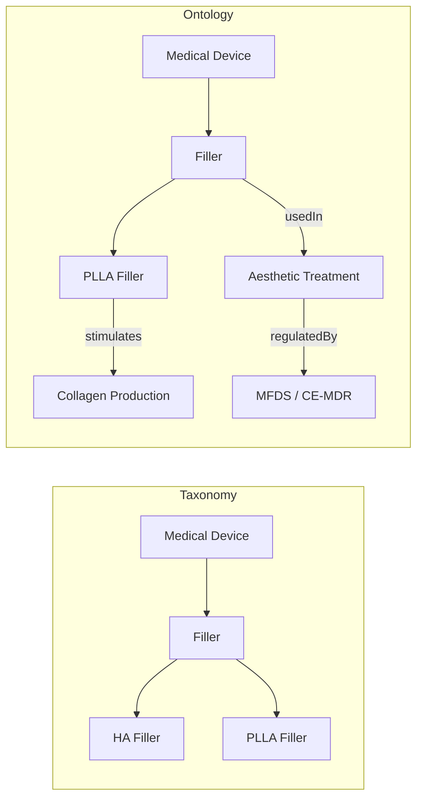

## 1. 핵심 차이 요약

| 구분 | 택소노미 (Taxonomy) | 온톨로지 (Ontology) |
|------|-------------------|-------------------|
| 정의 | 개념을 계층적으로 분류하는 체계 | 개념과 관계를 명시적으로 정의하는 지식 모델 |
| 구조 | 트리(Tree) 구조 | 그래프(Graph) 구조 |
| 관계 | 부모-자식 관계 중심 (is-a) | 다양한 관계 표현 (is-a, part-of, has-property, causes, interacts-with 등) |
| 목적 | 분류와 탐색 편의성 | 의미적 추론, 관계 분석, 지식 공유 |
| 유연성 | 고정적, 단일 계층 | 확장적, 다중 관계 |
| 예시 | 도서 분류체계, 생물 분류표 | 시맨틱 웹, 지식 그래프, Palantir Foundry |

---

## 2. 시각적 구조 비교

택소노미는 **수직적 계층**만 존재한다. 온톨로지는 **수평적 관계, 인과 관계, 속성 관계** 등 다양한 차원의 연결이 가능하다.

---

## 3. 관계적 확장성의 차이

**Taxonomy — 분류 중심**
- 지식을 계층적으로 나열한다
- "무엇이 무엇의 하위 개념인가"만 표현 가능
- 개념 간 상호작용이나 의존 관계는 표현하지 못한다
- 도서관 분류체계, 생물학 계통 분류, 조직도에 적합

**Ontology — 의미 중심**
- 관계와 속성을 포함하여 지식의 맥락을 정의한다
- AI가 이해하고 추론 가능한 구조를 제공한다
- "A는 B를 생산하고, B는 C 규제를 받으며, C는 D 시장에서 적용된다"처럼 복합 관계 표현 가능
- 시맨틱 웹, 지식 그래프, 기업 데이터 통합에 적합

---

## 4. 언제 무엇을 쓸까

| 상황 | 추천 |
|------|------|
| 단순 분류, 탐색 편의성이 목적 | Taxonomy |
| AI 추론, 관계 분석이 목적 | Ontology |
| 콘텐츠 태그 체계 설계 | Taxonomy로 시작 |
| 기업 지식 통합, 데이터 연결 | Ontology로 확장 |
| Obsidian 폴더·태그 구조 | Taxonomy |
| Obsidian 노트 간 의미적 링크 | Ontology적 사고 |

---

## 5. 결론

> 택소노미는 "책장의 분류표"다 — 무엇이 어디 있는지를 알려준다.  
> 온톨로지는 "지식의 세계지도"다 — 무엇이 무엇과 어떻게 연결되는지를 알려준다.

실용적 접근: PKM이나 조직 지식 시스템을 설계할 때, **택소노미로 분류 골격을 세우고, 온톨로지로 의미적 관계를 확장**하는 것이 효과적이다.

## 관련 노트

- 온톨로지(Ontology) — 온톨로지 개념의 정의·구성요소 (이 비교의 상위 개념)
- 팔란티어와 온톨로지 — 온톨로지를 기업 데이터에 구현한 대표 사례
- 조직지식관리 온톨로지 설계 예시 — 택소노미와 온톨로지를 조직 지식에 적용한 실전 설계
- gbrain — Legion 볼트의 검색·합성 레이어 — Obsidian 링크로 온톨로지적 사고를 실천하는 도구

---

*참고: Wikipedia - Taxonomy (general), Ontology (information science) · W3C - OWL 2 Web Ontology Language*
